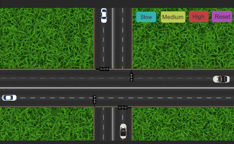

# Traffic_Simulation
## Threading 

El threading es una tecnica que permite que una aplicacion pueda ejecutar sumultaniamente 
varias operaciones en el mismmo espacio o mismo ambiente.

## Proyecto

Primeramente este proyecto se baso en una simulacion de trafico para poder probar lo que son
los threads aplicados en un programa, con este programa pudimos observar esto de la siguiente manera:



Como podemos ver los carros tendran un spawn al inicio del mapa, y tendran una velocidad ppor defecto
la cual podra aumentarse o disminuirse por medio de unity y los botones puestos en el programa.

Ademas cuando las luces lleguen a rojo el carro que se encuentre en ese semaforo hara un stop y luego cuando se
ponga verde ira nuevamente hasta el final donde el objeto carro se destruira para asi poder volver a spawnear.

En lo que se refiere al threading en este proyecto, se implemento de la siguiente manera:

```csharp
IEnumerator trafficLights()
{
  while(true)
  {
    tlGreen();
    yield return new WaitForSeconds(7);
    tlYellow();
    yield return new WaitForSeconds(4);
    tlRed();
    yield return new WaitForSeconds(11);
  }
}
```
Se hizo de esta manera para controlar el flujo de los semaforos y la manera en el cual correra especificamente para
que no hayan colisiones dentro del programa.
